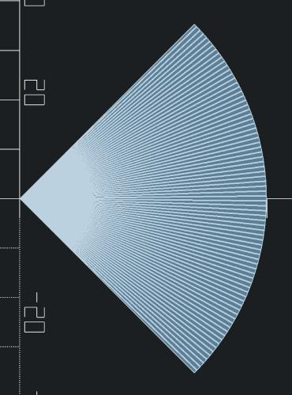
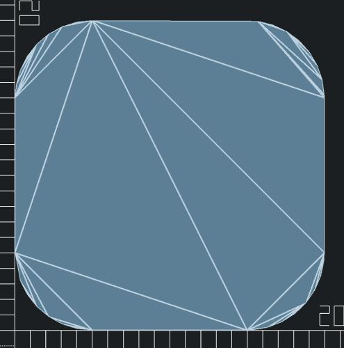
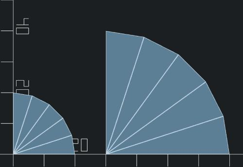
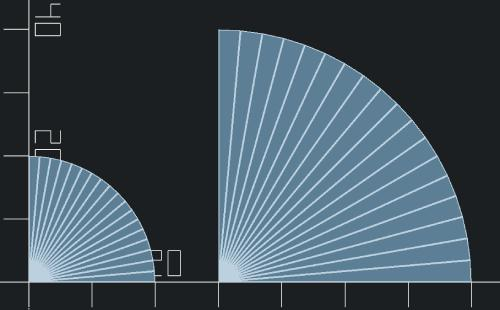
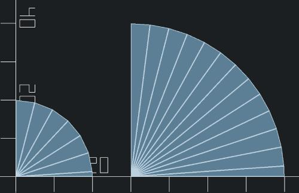

# arc.scad
functions for plotting arcs in SCAD


### Syntax

> ```
> array<array<x,y>> arc(x, y, from, to, [radius], [diameter], [$fn], [$fa], [$fs])
> ```
>
> <table>
>   <tr><td>x</td>       <td>number</td>                                  <td>The center x point of the arc</td></tr>
>   <tr><td>y</td>       <td>number</td>                                  <td>The center y point of the arc</td></tr>
>   <tr><td>from</td>    <td>number</td>                                  <td>The starting angle of the arc</td></tr>
>   <tr><td>to</td>      <td>number</td>                                  <td>The ending angle of the arc</td></tr>
>   <tr><td>radius</td>  <td>number</td>                                  <td>(optional) The radius of the arc</td></tr>
>   <tr><td>diameter</td><td>number</td>                                  <td>(optional) The diameter of the arc</td></tr>
>   <tr><td>$fn</td>     <td>number</td>                                  <td>(optional) The number of segments of the arc</td></tr>
>   <tr><td>$fa</td>     <td>number</td>                                  <td>(optional) The angle the arc will be segmented by</td></tr>
>   <tr><td>$fs</td>     <td>number</td>                                  <td>(optional) The magnitude the arc will be segmented by</td></tr>
>   <tr><td>returns</td> <td>array&lt;array&lt;number, number&gt;&gt;</td><td>Returns the collection of 2d points for the arc</td></tr>
> </table>
>
> `x`, `y`, `from`, `to` and either `radius` or `diameter` are required.
> The default segment setting is `$fs=1`.


### Usage

> ```scad
> // Draws a 90 degree pie slice starting at 45 degrees
> polygon(points = concat(
>   [[0,0]], // center point
>   arc(0,0,45,135,radius=50)
> ));
> ```
>
> 


> ```scad
> // Draws a square with rounded corners
> size = 20;
> corner = 5;
> polygon(points = concat(
>   arc(corner,corner,-90,-180,radius=corner), // lower-left corner
>   arc(size-corner,corner,180,90,radius=corner), // lower-right corner
>   arc(size-corner,size-corner,90,0,radius=corner), // upper-right corner
>   arc(corner,size-corner,0,-90,radius=corner) // upper-left corner
> ));
> ```
>
> 


> ```scad
> // Compares two arcs set to $fn=5 (i.e. 5 "total" segments)
> polygon(points = concat(
>     [[0,0]],
>     arc(0,0,0,90,20,$fn=5)
> ));
>         
> polygon(points = concat(
>     [[30,0]],
>     arc(30,0,0,90,40,$fn=5)
> ));
> ```
>
> 


> ```scad
> // Compares two arcs set to $fa=5 (i.e. segment per 5 degrees)
> polygon(points = concat(
>     [[0,0]],
>     arc(0,0,0,90,20,$fa=5)
> ));
>         
> polygon(points = concat(
>     [[30,0]],
>     arc(30,0,0,90,40,$fa=5)
> ));
> ```
>
> 


> ```scad
> // Compares two arcs set to $fs=5 (i.e. segment per 5mm)
> polygon(points = concat(
>     [[0,0]],
>     arc(0,0,0,90,20,$fs=5)
> ));
>         
> polygon(points = concat(
>     [[30,0]],
>     arc(30,0,0,90,40,$fs=5)
> ));
> ```
>
> 
